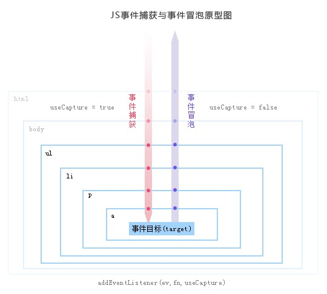

## DOM 事件机制
### 前言
javascript与HTML的交互是通过事件实现的。事件就是文档或浏览器窗口中发生的一些特定的交互瞬间。而事件流描述的是从页面中接受事件的顺序。本文将详细介绍该部分的内容
### 历史
> 当浏览器发展到第四代时(IE4及Netscape4)，浏览器开发团队遇到了一个很有意思的问题：页面的哪一部分会拥有某个特定的事件？想象画在一张纸上的一组同心圆。如果把手指放在圆心上，那么手指指向的不是一个圆，而是纸上的所有圆。两家公司的浏览器开发团队在看待浏览器事件方面还是一致的。如果单击了某个按钮，他们都认为单击事件不仅仅发生在按钮上。在单机按钮的同时，你也单机了按钮的容器元素，甚至也单击了整个页面。 
> 但有意思的是，IE和Netscape开发团队居然提出了差不多是完全相反的事件流的概念。IE的事件流是事件冒泡流，而Netscape的事件流是事件捕获流。
> （出自红宝书第三版p345）

### DOM事件流
下列HTML结构为例，说明事件冒泡、事件捕获
```html
<!DOCTYPE HTML>
<html lang="en">
<head>
<meta charset="UTF-8">
<title>Document</title>
<body>
<button></button>
</body>    
</html>
```
#### 事件冒泡(event bubbling)：从内向外找监听函数
* 浏览器检查实际点击的元素是否在冒泡阶段中注册了一个onclick事件处理程序，如果是，则运行它
* 然后它移动到下一个直接的祖先元素，并做同样的事情，然后是下一个，等等，直到它到达<code> <\html> </code>元素。

如果单击了页面中的<code> button </code>元素，那么这个click事件沿DOM树向上传播，在每一级节点上都会发生，按照如下顺序传播：
```html
(1)    <button>
(2)    <body>
(3)    <html>
(4)    document
```
#### 事件捕获(event capture)：从外向内找监听函数
* 浏览器检查元素的最外层祖先<code> <\html> </code>，是否在捕获阶段中注册了一个onclick事件处理程序，如果是，则运行它。
* 然后，它移动到<code> <\html> </code>中单击元素的下一个祖先元素，并执行相同的操作，然后是单击元素再下一个祖先元素，依此类推，直到到达实际点击的元素。

在事件捕获过程中，document对象首先接收到click事件，然后事件沿DOM树依次向下，一直传播到事件的实际目标，即<code> button </code>元素：
```html
(1)    document
(2)    <html>
(3)    <body>
(4)    <button>
```

#### DOM事件流：包括三个阶段：

1. 捕获阶段(The capture phase)：事件对象通过目标的祖先从Window传播到目标的父对象。
2. 目标阶段(The target phase)：事件对象到达事件对象的事件目标。如果事件类型指示事件没有发生，那么该事件对象将在此阶段完成后停止。
3. 冒泡阶段(The bubble phase)：事件对象以相反的顺序从目标的祖先开始传播，从目标的父项开始，到Window结束。

首先发生的是事件捕获阶段，为截获事件提供了机会。然后是实际的目标接受到事件。最后一个阶段是冒泡阶段，可以在这个阶段对事件做出响应。


#### addEventListener
##### 事件绑定API
* IE5*：div.attachEvent('onclick', fn) //冒泡
* 网景：div.addEventListener('click', fn)//捕获
* W3C ：div.addEventListener('click', fn, useCapture)
##### 如果bool不传或为falsy
就让fn放到冒泡阶段，即当浏览器在冒泡阶段发现div有fn监听函数，就会调用fn，并提供事件信息
##### 如果bool为true
就让fn放到捕获阶段，即当浏览器在捕获阶段发现div有fn监听函数，就会调用fn，并提供事件信息


部分资料来源： &copy;饥人谷
