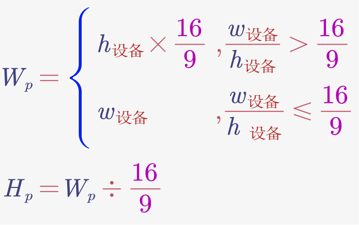
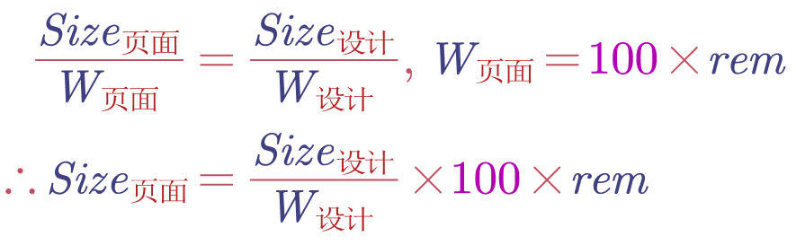

## 大屏可视化适配公式
### 整体页面
假设设计稿是16:9, 最好的显示结果也是16:9，但是实际大屏的比例可能不是16:9。

如果大屏的宽度很宽，依然要保持16:9，显示高度跟页面的高度一致，左右保持居中。

如果大屏的高度很高，一样要保持16:9，显示宽度跟页面的宽度一致，上下保持居中。

因此我们就总结出一个公式


Wp为页面有效宽度，Hp为页面有效高度

页面左右居中，上下居中，四周留白即可

然后再head里用JS设置1rem=Wp/100
#### 实践 index.html
```html
<script>
  window.clientWidth = document.documentElement.clientWidth
  window.clientHeight = document.documentElement.clientHeight

  window.pageWidth = clientWidth / clientHeight > 16 / 9 ?
    clientHeight * (16 / 9) :
    clientWidth
  window.pageHeight = pageWidth / (16 / 9)
  const string = `<style>html{
    font-size: ${pageWidth / 100}px;
  }</style>`
  document.write(string)
</script>

<script>
  root.style.height = pageHeight + 'px'
  root.style.marginTop = (clientHeight - pageHeight) / 2
</script>
```
### 具体模块

假设某 div 在设计稿中长 100px，设计稿宽度 1920px

那么该 div 在页面中长为 100/1920 X 100rem

最后可以写一个 px() 函数来计算 100px 对应的 rem

#### 实践

```scss
@function px($n){
  @return calc($n / 1920) * 100rem
}
```